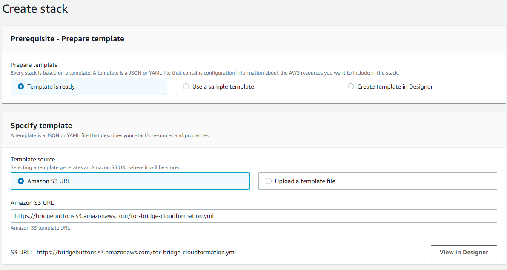
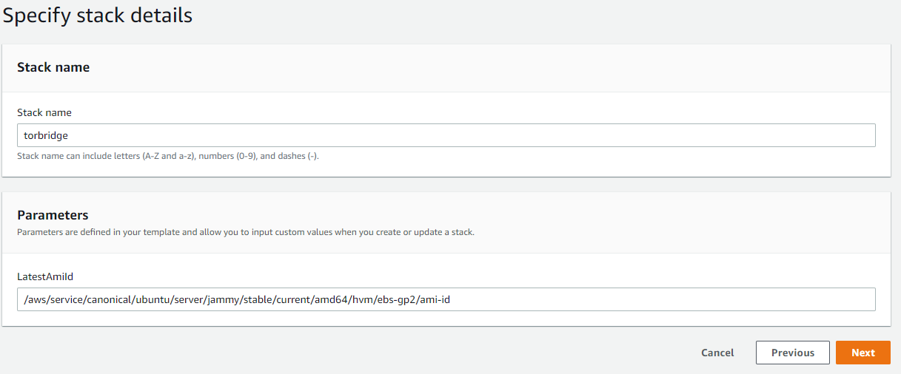
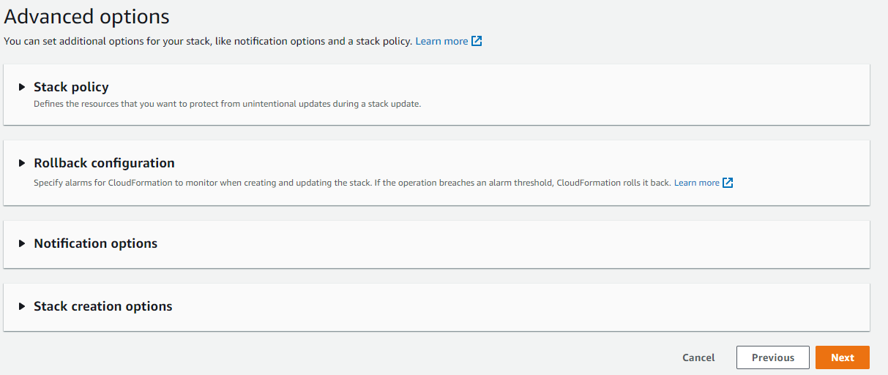
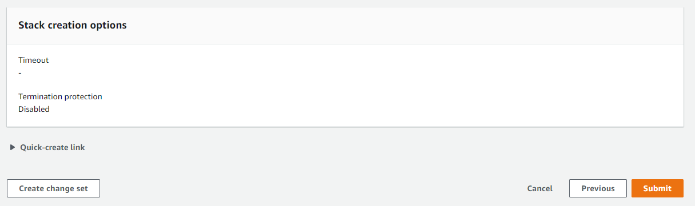
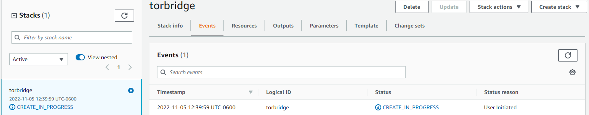
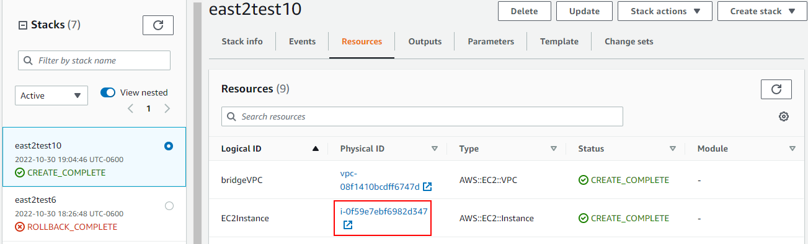
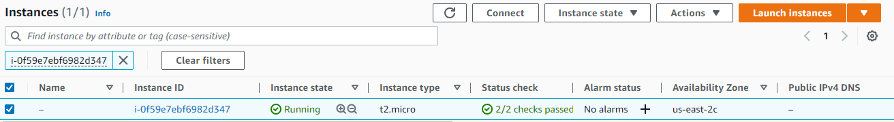
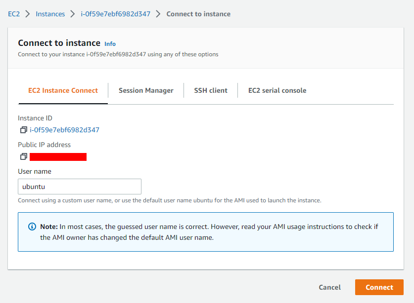
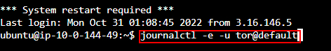
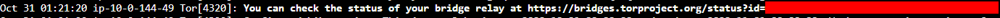

Bridge Buttons are one of the easiest ways to stand up for the journalists, activists, and vulnerable citizens around the world that depend on Tor to use the internet safely. Tor is an anonymity network that helps keep its users anonymous by routing their internet traffic through multiple different machines run by volunteers, which conceals their location and identity. Unfortunately regimes around the world have blocked access to Tor, which is why Tor bridges were created. They are brand-new access points these regimes do not know about that can be rapidly deployed and torn down faster than they can be blocked, letting these users get back online!

Bridge Buttons let you deploy a Tor bridge with a single click to any Amazon Web Services (AWS) region. These bridges come pre-configured to stay with in AWS' free tier for one year! While you will be prompted for a payment method when first signing up for AWS, these bridges are configured to use AWS' free computing product and have a Tor configuration that caps the bandwidth passing through your bridge at under 15GB.

# What is a Tor bridge?

You will be acting as an access point to the Tor network. Your bridge is a computer that will relay traffic for these users to their next Tor relay, but the key is that your bridge is never listed publicly. This makes it difficult for it to be blocked. It also helps hide that a user is connecting to Tor since they won't be connecting to a machine publicly connected to Tor.

# Is hosting a Tor bridge safe?

Yes! You may have heard that it can be potentially dangerous to run a Tor exit node, where traffic exits the Tor network. These are different from Tor bridges. Your bridge will not be publicly listed. Your bridge also is an entry point- an exit node makes the final connection to the website the user requests and therefore appears to be doing the "browsing".

# If my bridge isn't publicly listed, how to people get to it?

Tor distributes bridges to users who request them over email, or via [https://bridges.torproject.org/](https://bridges.torproject.org/). This makes it difficult for adversaries to compile a list of all Tor bridges and block them, since the number that are distributed at a time is limited.

# How do I deploy my bridge?

First, sign up for an AWS account [here](https://portal.aws.amazon.com/billing/signup#/start/email). While you will be prompted for payment information, your bridge is expected to run on the free tier.

Next, find the region you would like to deploy to in the world and click the corresponding button and then follow the instructions below. Consider deploying your bridge closer to a region that needs Tor bridges. For example, if you wish to help Iranian activists consider deploying to Bahrain.

| Region | Bridge Button |
|--------|---------------|
| US East (Ohio)       |               |
| US East (N. Virginia)       |                    |
| US West (N. California)       |               |
| US West (Oregon)       |               |
| Africa (Cape Town)       |               |
| Asia Pacific (Hong Kong)       |               |
| Asia Pacific (Jakarta)       |               |
| Asia Pacific (Mumbai)       |               |
| Asia Pacific (Osaka)       |               |
| Asia Pacific (Seoul)       |               |
| Asia Pacific (Singapore)       |               |
| Asia Pacific (Sydney)       |               |
| Asia Pacific (Tokyo)       |               |
| Canada (Central)       |               |
| Europe (Frankfurt)       |               |
| Europe (Ireland)       |               |
| Europe (London)       |               |
| Europe (Milan)       |               |
| Europe (Paris)       |               |
| Europe (Stockholm)       |               |
| Middle East (Bahrain)       |               |
| Middle East (UAE)       |               |
| South America (São Paulo)       |               |

On the next screen, ensure that the Amazon S3 URL is https://bridgebuttons.s3.amazonaws.com/tor-bridge-cloudformation.yml as below and then click "Next" at the bottom of the screen.

On the next screen, modify your bridge's name if you wish. This is optional and only makes it easier to find on the AWS console later. Click "Next".

On the "Configure Stack" page leave all options alone and scroll to the bottom of the page. Click "Next".

On the "Review" page, leave all options alone and scroll to the bottom of the page. Click "Submit".

You will then be brought to the CloudFormation screen where you can monitor your deployment. This will take several minutes. When finished, the status will change to green text that reads "Create Complete". Your bridge is now up and running!

# Optional - find your Tor bridge status address

If you would like to find the address where you can monitor the status of your Tor bridge, follow these steps.

After deploying wait approximately 20 minutes to an hour to allow Tor to install and start on your bridge's machine.

Next, return to the CloudFormation screen where you were initially taken while the bridge deployed. If you have closed this window, the address will be https://<your deployment region>.console.aws.amazon.com/cloudformation. Be sure to substitute the short name of the region you deployed to (for example, us-east-1), which you can find [here](https://docs.aws.amazon.com/AmazonRDS/latest/UserGuide/Concepts.RegionsAndAvailabilityZones.html).

Click your stack from the list. It will be named "torbridge" unless you changed the name during deployment. Click the "Resources" tab and then click the link next to "EC2 Instance".

On the next screen click the checkmark next to the only instance in the list as below. This is the machine your bridge is running on! The "Connect" button at the top of the screen will now be enabled. Click this button.

On the next screen, click "Connect". You will now connect with this machine in your web browser.

When the connection screen finishes loading, enter the command "journalctl -e -u tor@default" as below. Press the enter key.

Use the up and down arrows to scroll through the Tor logs. You may already have had a user! You are looking for a line similar to the one in the below screenshot that provides your status URL. Copy this URL and bookmark it or keep it in a safe place to check the status of your bridge at any time. If you do not see this line, the deployment may not have finished yet. Close this window and try these steps again in a few minutes.

